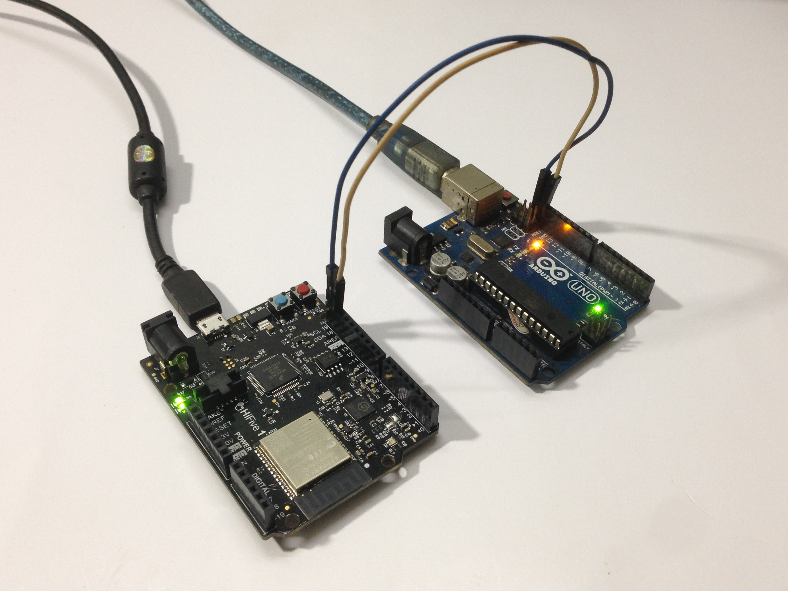

# hifive1-revb-test-i2c-with-arduino
This is an example of communication between SiFive Hifive 1 Rev B board and Arduino UNO board

# Development tools
- SiFive IDE: FreedomStudio-2019-08-2-win64 (https://github.com/sifive/freedom-studio/releases/tag/v2019.08.2)
- Arduino IDE: arduino (https://www.arduino.cc/en/software)

# Document
- I2C-Master Core Specification (https://github.com/olofk/i2c/blob/master/doc/i2c_specs.pdf)
- SiFive FE310-G002 Manual v19p05 - fe310-g002-manual-v19p05.pdf
